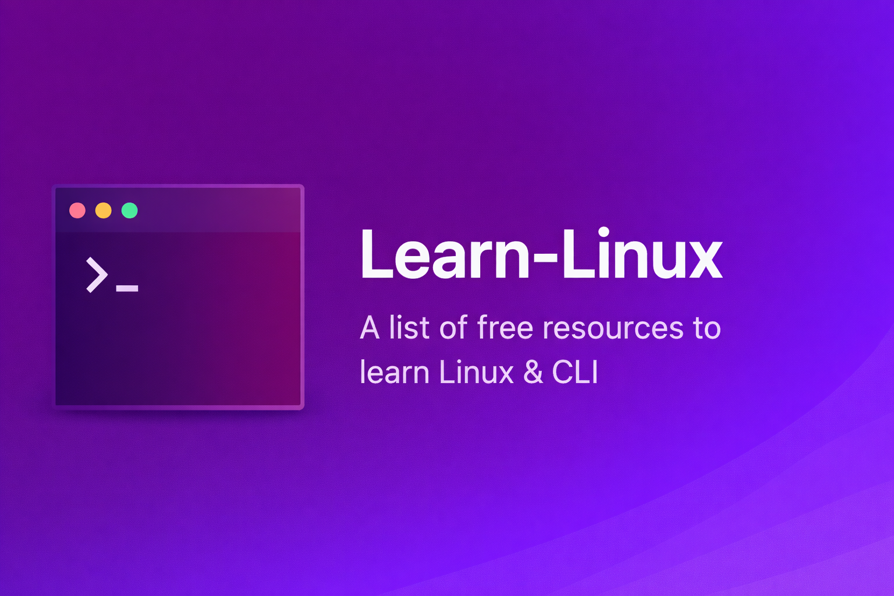

  

**Learn Linux**  
A curated collection of free, high quality resources to learn Linux, the command line, and system fundamentals.

0. [Linux Journey](https://linuxjourney.com)
1. [Linux Command Line](https://lym.readthedocs.io/en/latest/index.html)  
2. [Linux Commands Handbook](https://www.freecodecamp.org/news/the-linux-commands-handbook/)
3. [Linux Handbook](https://linuxhandbook.com)
4. [Tecmint](https://tecmint.com)
5. [LinuxOPsys](https://linuxopsys.com/)
6. [Linux Hint](https://linuxhint.com)
7. [Linuxtopia](https://www.linuxtopia.org/)
8. [Linuxize](https://linuxize.com)
9. [Eduonix Learn Linux From Scratch](https://eduonix.com/courses/system-programming/learn-linux-from-scratch)
10. [Cyberciti Bash Shell Scripting Tutorial](https://bash.cyberciti.biz/guide/Main_Page)
11. [Learn Enough Command Line To Be Dangerous](https://learnenough.com/command-line-tutorial)
12. [The Debian Administrator's Handbook](https://debian-handbook.info)
13. [LabEx Linux For Noobs](https://labex.io/courses/linux-for-noobs)
14. [nixCraft](https://cyberciti.biz)
15. [Conquering the Command Line](https://conqueringthecommandline.com)
16. [FOSS Linux](https://fosslinux.com)
17. [It's FOSS](https://itsfoss.com)
18. [Linux Survival](https://linuxsurvival.com)
19. [Ryan's Tutorials](https://ryanstutorials.net)
20. [TLDP Advanced Bash Scripting Guide](https://tldp.org/LDP/abs/html/)
21. [Guru99 Linux Tutorial Summary](https://guru99.com/unix-linux-tutorial.html)
22. [Geek-University's Linux Course ](https://geek-university.com/what-is-linux/)
23. [OverTheWire](https://overthewire.org/wargames/bandit/)
24. [CommandMasters](https://commandmasters.com)

## Shell / Bash Scripting

- [Shellscript.sh](https://www.shellscript.sh/)

## CLI / Vim

- [You Don't Need GUI](https://github.com/you-dont-need/You-Dont-Need-GUI) - CLI Commands Cheatsheet
- [Vim Cheatsheet](https://i.ibb.co/FbdMMHN/460e75dd8543.png) or [rTorr](https://vim.rtorr.com/) - Vim Code Editor Cheat Sheets
- [OpenVim](https://www.openvim.com/) - Interactive Vim Tutorial
- [Vim Adventures](https://vim-adventures.com/) - Vim Learning Game
- [Vim University](https://github.com/wincent/vim-university) - Vim Tips
- [The Linux Kernel](https://www.kernel.org/doc/html/latest/) - Linux Kernel Development Guides 
- [Workbench](https://github.com/sonnyp/Workbench) - Learn / Experiment with Gnome

## Security 

- [How to Secure A Linux Server](https://github.com/imthenachoman/How-To-Secure-A-Linux-Server?tab=readme-ov-file#why-secure-your-server)

## About

This repository exists to help beginners and intermediate users build strong Linux and CLI fundamentals using free resources.

## Contributing

Contributions are welcome and appreciated.

You can help by
- Adding new high quality Linux learning resources
- Fixing broken links
- Improving descriptions or categorization
- Improving documentation structure

Guidelines
1. Ensure resources are free and legally accessible
2. Prefer official documentation or well established community resources
3. Avoid low quality or spammy links
4. Keep descriptions concise and neutral

To contribute
1. Fork the repository
2. Create a new branch
3. Make your changes
4. Open a pull request with a clear description

